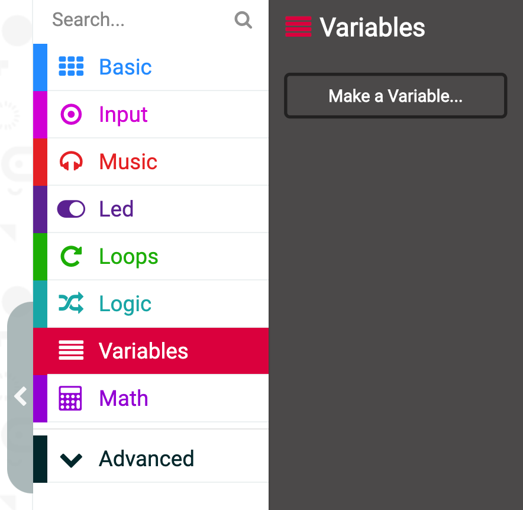
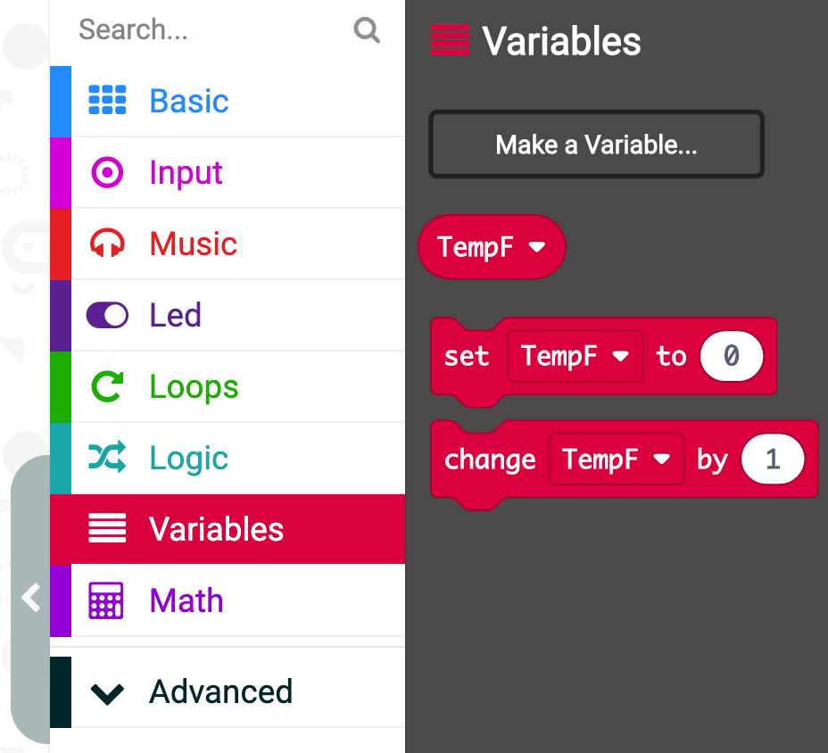

# Temperature Conversion Tutorial
The micro:bit is a great little tool. It includes a temperature sensor on the device. You won't see it as it is hidden within the chip on the backside (opposite from the buttons).

When you want to look at the temperature or use it in your code, you'll find that the values produced are in degrees Celsius.

The Celsius system is great, but it's less familiar to those in the U.S.

In this simple tutorial we will show you a way to make the conversion between degrees C and degrees F.

## Let's get started!

The first thing we will do is to create a new variable. One of the main blocks is called VARIABLES.

Select the VARIABLES block and then select MAKE A VARIABLE option.


When the option comes up to name your variable, use a name that will be meaningful to you. In this case we use "TempF" and select OK.


Once you create the variable you will then see that the VARIABLES block is now populated with more options. 

For now, we're interested in the SET [VARIABLE] TO [VALUE]. For our purpposes we want it to say SET TempF to 0, which we can drop into the ON START or FOREVER blocks, as below. 

```blocks
let TempF = 0
```
## Let's add in some basic math

The basic conversion from degrees C to degrees F follows:
Temperature (F) = 9/5(Temperature C) + 32

If we go into the MATH block you'll see there are a number blocks that have two values and an operator (+, -, x, /).

You can pick any of those blocks and drop it into the workspace. Click inside the first space in the block and type 9. Click inside the second space and type 5. Finally, change the operator between them by using the dropdown menu to the division symbol.
[insert pictures]

Now repeat that procedure and grab another similar block from the MATH block. This time we're going to take the block we just created and drag that to fit that entire block within the first space of the new block. 
Then go to the VARIABLE block and drag out the TempF block and drop it into the second space. Finally, change the operator to be an X for multiplying. It should look like below.  
[insert pictures]

Now we need to repeat this same procedure a third (and final!) time. For this round we will drop the compound block you just created into the first space of the new block. Then in the second space, type 32. If you know a little about temperatures, you know that water freezes at 32 degrees F and 0 degrees C. This is why we need to add 32 to the formula! Change the operator so that it is a +. 
[insert pictures]

We now have the core of our code. 

## Let's try out our full code
You always want to run your code to make sure it works and debug, if necessary. 

Using this code, you can then incorporate your new variable TempF into other elements of code.

For now, we just want to check to see if it works. To do that we will use the SHOW NUMBER block, within the BASIC block to test. 

Drag out the SHOW NUMBER block and click it below FOREVER. Go into the VARIABLES block and drag your TempF variable out into the workspace and slide it into the space in the SHOW NUMBER block. 
 
```blocks
let TempF = 0
basic.forever(function () {
    TempF = 9 / 5 * input.temperature() + 32
    basic.showNumber(TempF)
})
```
You can use the temperature slider that appears in the micro:bit simulator to change the temperature C. 
The scrolling number on the screen should be the comparable value for the temperature, but in degrees F.   